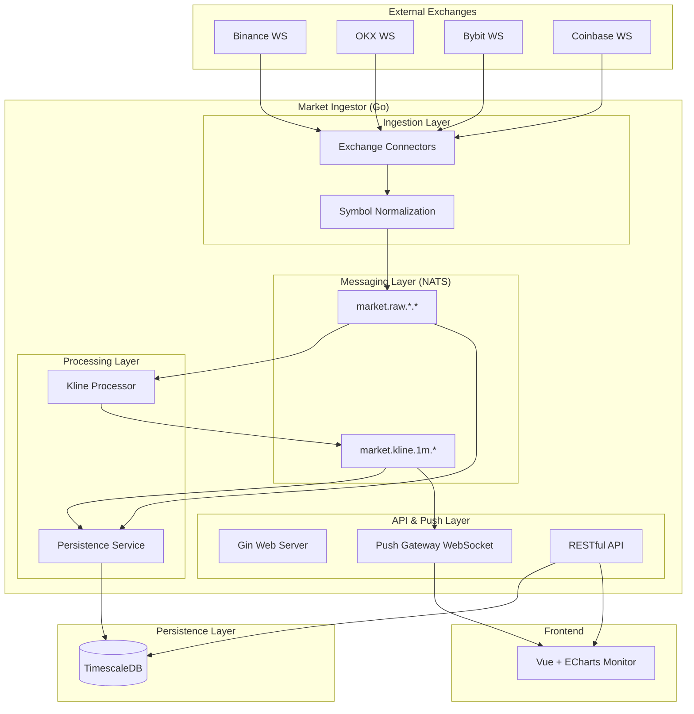

# Market Ingestor - 技术架构与设计文档

本文档详细介绍了 `quant-trader` 模块的架构设计、职责拆分、核心流程以及开发指南，旨在帮助开发者理解项目结构并遵循最佳实践进行后续开发。

## 1. 项目架构图 (Architecture Diagram)

## 2. 模块功能说明 (Module Descriptions)

### 2.1 核心组件

- **`internal/app`**: 应用生命周期管理器。负责所有组件的初始化（DB, NATS, HTTP Server）和优雅停机。遵循 **职责单一原则 (SRP)**。
- **`api/`**: 外部 HTTP 接口层。包含 RESTful 处理函数 (`handler.go`) 和认证中间件 (`middleware.go`)。
- **`internal/connector/`**: 交易所适配器。每个交易所都有独立的实现，负责维护 WebSocket 连接、重连机制和原始数据解析。
- **`internal/processor/`**: 流式处理器。核心是 `KlineProcessor`，它订阅原始成交数据 (`market.raw`) 并聚合生成 1 分钟 K 线。
- **`internal/storage/`**: 持久化层。使用批量插入 (Batch Insert) 优化写入性能，支持 `Trade` 和 `KLine` 的存储。
- **`internal/push/`**: 实时推送网关。基于 NATS 订阅和 WebSocket，实现高效的消息广播。

## 3. 关键设计决策 (Key Design Decisions)

### 3.1 职责拆分与解耦

项目从原先臃肿的 `main.go` 重构为模块化的 `internal/app` 结构：

- **`main.go`**: 仅作为入口，负责启动 `app.App`。
- **依赖注入**: `App` 结构体持有所有核心依赖（DB, Logger, NATS），通过显式传递而非全局变量进行交互，提高了代码的可测试性。

### 3.2 消息驱动架构 (EDA)

使用 **NATS JetStream** 作为消息总线：

- **解耦**: 数据采集 (Ingestion) 与数据处理 (Processing/Storage) 完全解耦。
- **可靠性**: 利用 JetStream 的持久化特性，确保在处理服务重启时不会丢失市场数据。

### 3.3 数据归一化 (Symbol Normalization)

各交易所的交易对命名格式不一（如 `BTC-USDT`, `btcusdt`, `XBT/USD`）。系统在进入消息总线前会进行强制归一化为 `BTCUSDT` 格式，确保下游处理逻辑的一致性。

## 4. 学习指南 (Learning Guide)

### 4.1 如何添加一个新的交易所？

1. 在 `internal/connector/` 下创建新的实现文件。
2. 实现 `Run(ctx context.Context, tradeChan chan<- model.Trade)` 方法。
3. 在 `internal/app/worker.go` 的 `startIngestionWorker` 方法中添加该交易所的配置。

### 4.2 核心调用关系流程

1. **启动**: `main.go` -> `app.NewApp()` -> `app.Init()` -> `app.Run()`。
2. **采集**: `connector.Run()` -> 原始数据解析 -> `tradeChan`。
3. **发布**: `app.startIngestionWorker` 消费 `tradeChan` -> 归一化 Symbol -> NATS `market.raw`。
4. **聚合**: `KlineProcessor` 订阅 `market.raw` -> 内存聚合 -> 每 5s 刷新并发布到 NATS `market.kline`。
5. **持久化**: `PersistenceService` 订阅 `market.raw` 和 `market.kline` -> 批量写入 TimescaleDB。

## 5. 开发规范

- **错误处理**: 所有的初始化方法必须返回 `error`，并在 `main.go` 中进行致命错误处理。
- **日志**: 使用 `zap` 结构化日志，避免使用 `fmt.Println`。
- **并发**: 所有的长驻任务（如 Connector, Processor）必须支持 `context.Context` 以便优雅停机。
