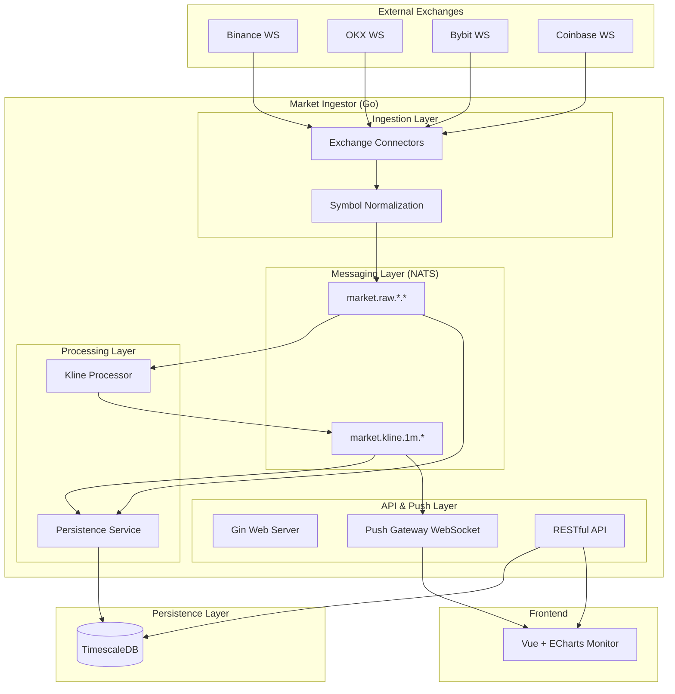

# Market Ingestor - Technical Architecture & Design

This document provides a detailed overview of the `market-ingestor` module's architectural design, responsibility split, core flows, and developer guides.

## 1. Architecture Diagram

## 2. Module Descriptions

### 2.1 Core Components

- **`internal/app`**: Application lifecycle manager. Responsible for initializing all components (DB, NATS, HTTP Server) and graceful shutdown. Follows the **Single Responsibility Principle (SRP)**.
- **`api/`**: External HTTP interface layer. Contains RESTful handlers (`handler.go`) and authentication middleware (`middleware.go`).
- **`internal/connector/`**: Exchange adapters. Each exchange has an independent implementation responsible for maintaining WebSocket connections, reconnection mechanisms, and raw data parsing.
- **`internal/processor/`**: Stream processors. The core is `KlineProcessor`, which subscribes to raw trade data (`market.raw`) and aggregates it into 1-minute K-lines.
- **`internal/storage/`**: Persistence layer. Uses Batch Insert to optimize write performance, supporting storage for both `Trade` and `KLine`.
- **`internal/push/`**: Real-time push gateway. Based on NATS subscriptions and WebSocket for efficient message broadcasting.

## 3. Key Design Decisions

### 3.1 Responsibility Split & Decoupling
The project was refactored from a bulky `main.go` into a modular `internal/app` structure:
- **`main.go`**: Acts only as an entry point, responsible for starting `app.App`.
- **Dependency Injection**: The `App` struct holds all core dependencies (DB, Logger, NATS), interacting through explicit passing rather than global variables, which improves testability.

### 3.2 Event-Driven Architecture (EDA)
Uses **NATS JetStream** as the message bus:
- **Decoupling**: Data ingestion is completely decoupled from processing and storage.
- **Reliability**: Leverages JetStream's persistence to ensure no market data is lost when processing services restart.

### 3.3 Symbol Normalization
Exchanges use different naming formats (e.g., `BTC-USDT`, `btcusdt`, `XBT/USD`). The system normalizes these to `BTCUSDT` before entering the message bus to ensure consistency in downstream logic.

## 4. Learning Guide

### 4.1 How to add a new exchange?
1. Create a new implementation file in `internal/connector/`.
2. Implement the `Run(ctx context.Context, tradeChan chan<- model.Trade)` method.
3. Register the exchange configuration in the `startIngestionWorker` method of `internal/app/worker.go`.

### 4.2 Core Call Flow
1. **Startup**: `main.go` -> `app.NewApp()` -> `app.Init()` -> `app.Run()`.
2. **Ingestion**: `connector.Run()` -> raw data parsing -> `tradeChan`.
3. **Publishing**: `app.startIngestionWorker` consumes `tradeChan` -> Symbol normalization -> NATS `market.raw`.
4. **Aggregation**: `KlineProcessor` subscribes to `market.raw` -> in-memory aggregation -> flushes and publishes to NATS `market.kline` every 5s.
5. **Persistence**: `PersistenceService` subscribes to `market.raw` and `market.kline` -> batch writes to TimescaleDB.

## 5. Development Standards
- **Error Handling**: All initialization methods must return an `error`, which is handled as a fatal error in `main.go`.
- **Logging**: Use `zap` structured logging; avoid `fmt.Println`.
- **Concurrency**: All long-running tasks (e.g., Connector, Processor) must support `context.Context` for graceful shutdown.
