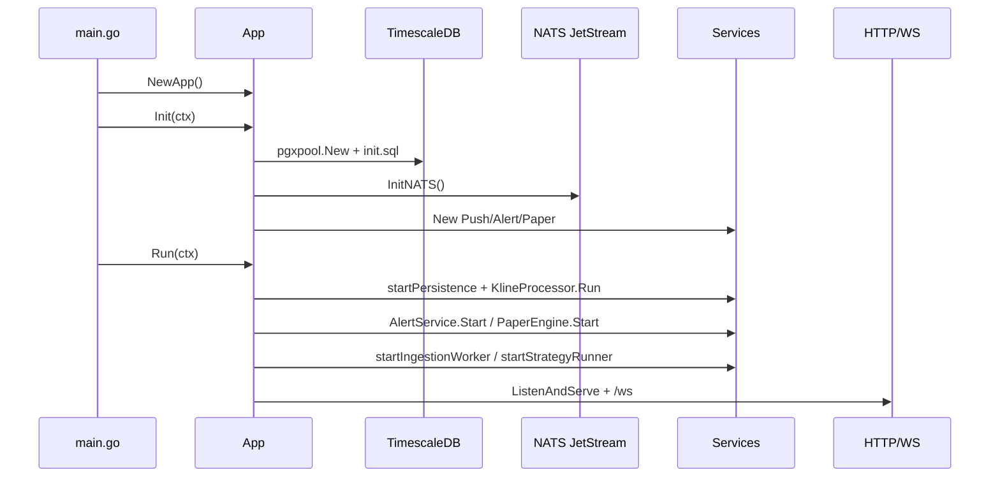
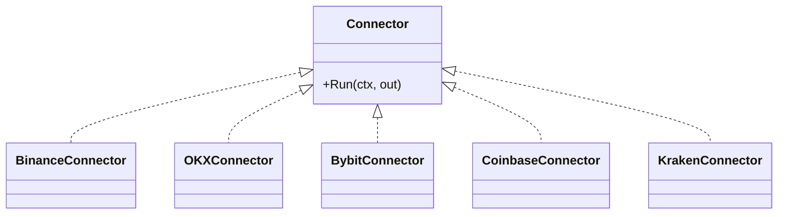
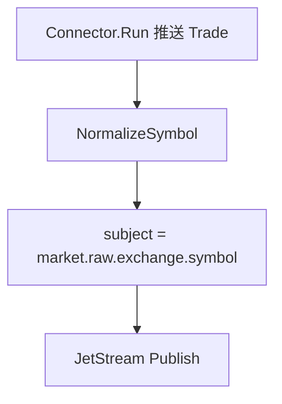
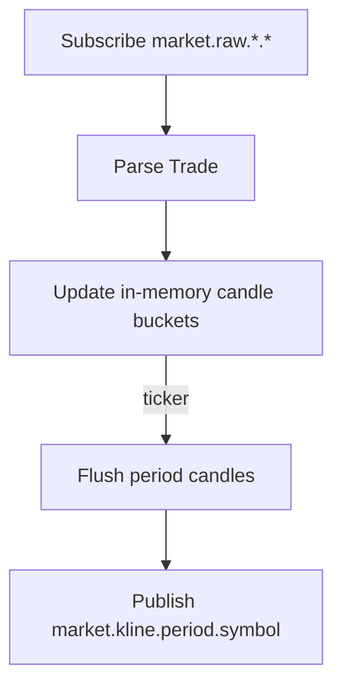
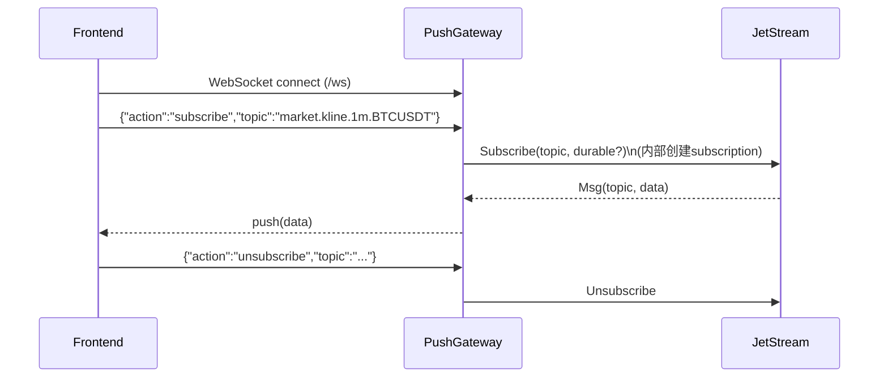
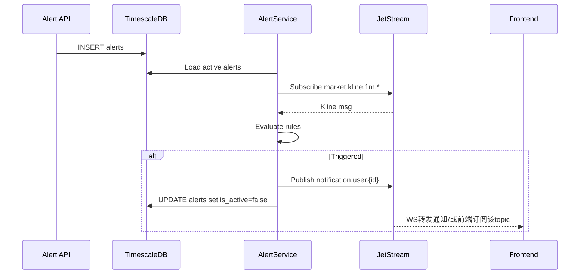
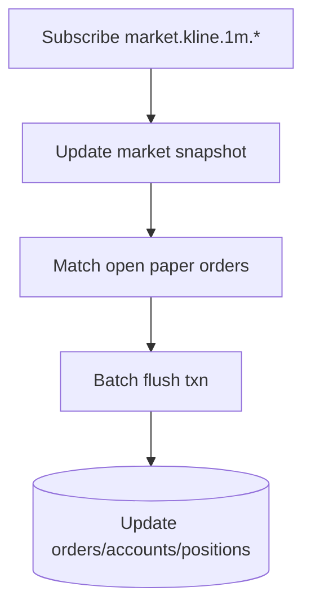
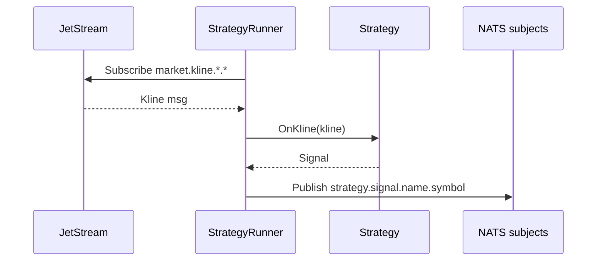
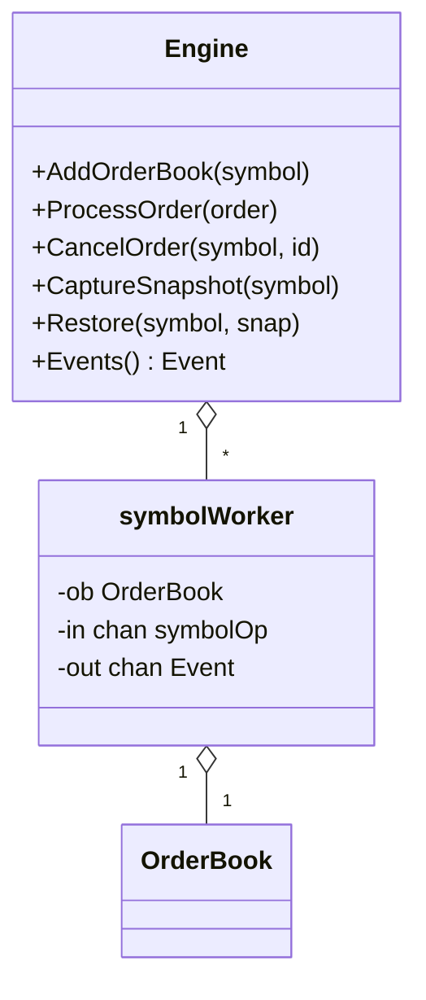

# quant-trader 项目代码分析报告

本文档面向需要“读懂、改动、上线”的工程师，覆盖系统架构、核心模块实现、代码组织规范、10 个典型场景端到端追踪，以及推荐学习路线。配套图示位于 [`/diagrams`](file:///Users/yiying/GoProjects/quant-trader/diagrams/)，代码摘要示例位于 [`/examples`](file:///Users/yiying/GoProjects/quant-trader/examples/)。

## 阅读导航与预计学习时长

- 速览（1–2 小时）：[架构与数据流](#1-项目架构分析) + [典型场景 1/3/4](#4-典型场景跟踪10个)
- 能改动（6–10 小时）：在速览基础上通读 [K线处理](#k线处理器-internalprocessorklinego)、[落库](#持久化层-internalstorage)、[WS网关](#ws推送网关-internalpushgatewaygo)、[模拟交易](#模拟交易-internalpaperenginego)
- 能上线（12–20 小时）：增加 [NATS JetStream 语义](#术语表)、[CI与监控](#3-代码组织规范)、[撮合WAL快照HA](#撮合引擎-internalmatching) 的理解与演练

---

# 1. 项目架构分析

预计学习时长：2–4 小时

## 1.1 整体架构与技术栈

系统定位：面向量化交易与研究的实时数据平台（行情接入→事件总线→处理/持久化→策略/预警/模拟交易→API/WS对外），并在后端引入可独立演进的撮合引擎子系统（matching）。

### 后端技术栈（backend）

- 语言与框架：Go + Gin（REST）
- 数据库：TimescaleDB/Postgres（通过 pgx/pgxpool 访问）
- 消息中间件：NATS JetStream（stream/consumer/KV）
- 观测：zap（结构化日志）、Prometheus（/metrics）
- 安全与权限：JWT（AuthMiddleware）、订阅限制（SubscriptionMiddleware）、限流（RateLimitMiddleware）
- 金融数值：shopspring/decimal
- 策略隔离：wazero（WASM Runner）

### 前端技术栈（frontend）

- React + Vite
- 状态与数据：Zustand（store）、React Query（请求缓存）
- 图表：ECharts
- 样式：Tailwind
- 实时：WebSocket（订阅 NATS topic 的服务端转发）

### 系统拓扑图（Mermaid）

见：[`diagrams/architecture_overview.mmd`](file:///Users/yiying/GoProjects/quant-trader/diagrams/architecture_overview.mmd)

```mermaid
graph TD
  subgraph Ingestion[接入层]
    C1[Exchange Connectors] --> N1[NormalizeSymbol]
  end

  subgraph Bus[NATS JetStream]
    R[market.raw.*.*]
    K[market.kline.*.*]
    S[strategy.signal.*.*]
  end

  subgraph Core[核心处理单元]
    KP[KlineProcessor]
    AS[AlertService]
    PE[PaperEngine]
    SR[StrategyRunner]
    PG[PushGateway]
  end

  subgraph Storage[持久化]
    TS[(TimescaleDB)]
    BS[BatchSaver]
    KS[KlineSaver]
  end

  subgraph API[对外接口]
    HTTP[Gin REST API]
    WS[/ws WebSocket]
  end

  C1 --> R
  R --> KP
  KP --> K
  R --> BS
  K --> KS
  K --> AS
  K --> PE
  K --> SR
  S --> PG
  K --> PG
  BS --> TS
  KS --> TS
  HTTP --> TS
  WS --> PG
```

## 1.2 模块划分与依赖关系

后端属于“模块化单体 + 事件驱动核心”的组合：进程内按 `internal/*` 切分业务域，模块之间尽量通过 NATS subject 解耦；少量需要强一致的路径使用 DB 事务或单写者 goroutine 模型。

关键入口与装配：

- 入口：[`backend/cmd/main.go`](file:///Users/yiying/GoProjects/quant-trader/backend/cmd/main.go)
- 应用装配与生命周期：[`backend/internal/app/app.go`](file:///Users/yiying/GoProjects/quant-trader/backend/internal/app/app.go)
- NATS/JetStream 初始化：[`backend/internal/infrastructure/nats.go`](file:///Users/yiying/GoProjects/quant-trader/backend/internal/infrastructure/nats.go)
- 行情接入 worker：[`backend/internal/app/worker.go`](file:///Users/yiying/GoProjects/quant-trader/backend/internal/app/worker.go)

依赖方向（简化）：

- app：负责装配 DB、NATS、服务对象，并启动 goroutines
- connector：只依赖 model + logger，不依赖 DB
- processor：依赖 NATS（订阅/发布），不依赖 DB
- storage：依赖 DB，不依赖 processor
- alert/paper/engine：依赖 NATS + DB
- api：依赖 DB + logger；通过 middleware 叠加鉴权/限流/订阅规则
- push：依赖 NATS（订阅 topic）+ websocket
- matching：相对独立，可通过 JetStream WAL/KV 接入 HA

## 1.3 数据流向与状态管理机制

### 1.3.1 NATS subjects（事件语义边界）

- 原始成交：`market.raw.{exchange}.{symbol}`（来自 connector，symbol 经 Normalize）
- K线：`market.kline.{period}.{symbol}`（来自 KlineProcessor）
- 策略信号：`strategy.signal.{strategyName}.{symbol}`（来自 StrategyRunner 或 WorkerPool）
- 通知：`notification.user.{userID}`（预警触发后发布）
- 撮合事件（matching）：`matching.event.{symbol}`（JetStream WAL 事件流）

这组 subject 形成“领域事件总线”的边界：接入层与处理/落库/预警/模拟交易之间不需要直接调用，仅通过 stream/consumer 来解耦与缓冲。

### 1.3.2 关键状态（in-memory + DB）

- `KlineProcessor`：按 symbol/period 维护当前 K 线桶（内存 map），定时 flush
- `BatchSaver`/`KlineSaver`：内存队列 + ticker 批处理写 DB
- `PaperEngine`：订单簿、账户、持仓的内存缓存 + 批处理落库（事务）
- `PushGateway`：每个 WS 连接维护订阅列表→对应 NATS subscription（动态订阅/取消）
- `matching.Engine`：每 symbol 一个 worker goroutine（单写者），状态仅在该 goroutine 内变更；事件写入 WAL，快照定时落 KV

### 1.3.3 并发模型（单写者 vs 多读）

本项目核心的状态一致性靠两类机制：

- 事件驱动 + 最终一致（NATS）：消费者以 durable 方式订阅并手动 ack，结合 DB upsert/幂等写入
- 单写者模型（matching/paper 内部局部使用）：每 symbol/每引擎用 goroutine 串行处理操作，避免锁竞争与复杂并发 bug

## 1.4 关键设计模式与架构原则

- 事件驱动解耦：用 NATS subjects 将“接入/处理/落库/服务”拆开
- Durable consumer：保证处理可恢复（至少一次投递），代价是需要幂等/去重策略
- 批处理写入：`BatchSaver`、`KlineSaver`、PaperEngine flush，用时间窗口换吞吐与 IO 效率
- 单写者/Actor 模型：matching `symbolWorker` 通过 `chan symbolOp` 串行化状态变更
- 可恢复性（matching）：WAL + 快照 + 租约，支持多实例下“同一 symbol 仅一个 leader 写状态”

---

# 2. 核心功能实现分析

预计学习时长：8–14 小时（按模块选择性深入）

本章按模块拆解，每个模块包含：定位与价值、结构图、关键流程、时序交互、性能点与特殊处理。配套图示源码集中在 `diagrams/`，本章会内嵌关键图。

## 启动与装配（internal/app）

### 功能定位与业务价值

- 定义“应用生命周期”：初始化依赖（DB/NATS），启动后台服务（持久化、K线、预警、策略、模拟交易、WS/HTTP）
- 作为组合根（composition root），避免业务模块互相直接 new 依赖导致耦合

### 关键文件

- App 生命周期：[`backend/internal/app/app.go`](file:///Users/yiying/GoProjects/quant-trader/backend/internal/app/app.go)
- 行情接入与持久化订阅：[`backend/internal/app/worker.go`](file:///Users/yiying/GoProjects/quant-trader/backend/internal/app/worker.go)
- matching 启动/leader：[`backend/internal/app/matching_boot.go`](file:///Users/yiying/GoProjects/quant-trader/backend/internal/app/matching_boot.go)

### 启动时序图（简化）



### 性能/特殊处理

- 启动大量 goroutine：每个交易所 target 一个 goroutine + 订阅回调，依赖 `context` 优雅停机
- `/metrics` 暴露 Prometheus 指标（见 [metrics.go](file:///Users/yiying/GoProjects/quant-trader/backend/internal/infrastructure/metrics.go)）

## 接入层（internal/connector）

### 功能定位与业务价值

- 维护各交易所 WebSocket 连接，转成统一的 `model.Trade`
- 通过 `NormalizeSymbol()` 将交易所特有 symbol 归一化为内部标准（如 BTCUSDT）

### 组件结构图（示意）



### 关键流程（接入→发布 raw）

入口：[`startIngestionWorker`](file:///Users/yiying/GoProjects/quant-trader/backend/internal/app/worker.go#L29-L90)



### 性能/特殊处理

- 输入 channel 有缓冲（`tradeChan := make(chan model.Trade, 1000)`），降低短时抖动导致的阻塞
- 发布失败会记录日志；可结合 `IngestLatency/TradeProcessRate` 指标（见 metrics）

## NATS/JetStream 基础设施（internal/infrastructure）

### 功能定位与业务价值

- 统一初始化 NATS 连接与 JetStream Context
- 负责创建/确保 `MARKET` stream（覆盖 raw/kline subjects），为上游发布与下游 durable 订阅提供持久化语义

关键文件：[`backend/internal/infrastructure/nats.go`](file:///Users/yiying/GoProjects/quant-trader/backend/internal/infrastructure/nats.go)

### 性能/特殊处理

JetStream 的 durable consumer（在各模块 Subscribe 时指定 durable 名称）是“可恢复处理”的核心；代价是至少一次投递，需要 DB 写入幂等/去重策略配合。

## K线处理器（internal/processor/kline.go）

### 功能定位与业务价值

- 将 tick/trade 流聚合为多周期 K 线（1m/5m/15m/1h/…），作为策略、预警、模拟交易的统一上游

关键文件：[`kline.go`](file:///Users/yiying/GoProjects/quant-trader/backend/internal/processor/kline.go)

### 关键算法流程图



### 性能优化点

- 采用内存聚合 + 定时 flush，减少 DB/下游事件频率
- `Subscribe` 使用 durable + manual ack，避免消费丢失

### 关键代码片段（注释式解读示例）

示例文件详解在：[`examples/kline_aggregation_walkthrough.md`](file:///Users/yiying/GoProjects/quant-trader/examples/kline_aggregation_walkthrough.md)

## 持久化层（internal/storage）

### 功能定位与业务价值

- 将 `market.raw.*.*` 与 `market.kline.*.*` 批量写入 TimescaleDB
- 提供 backfill 回填能力（历史数据补齐/纠错）

关键文件：

- Trades 批写：[`saver.go`](file:///Users/yiying/GoProjects/quant-trader/backend/internal/storage/saver.go)
- K线批写：[`kline_saver.go`](file:///Users/yiying/GoProjects/quant-trader/backend/internal/storage/kline_saver.go)
- 回填：[`backfiller.go`](file:///Users/yiying/GoProjects/quant-trader/backend/internal/storage/backfiller.go)

### 性能优化点

- 批处理（ticker + batch size），减少 SQL 往返
- Upsert/冲突处理以支持至少一次投递带来的重复消息

## WS推送网关（internal/push/gateway.go）

### 功能定位与业务价值

- 向前端提供统一的实时订阅入口：前端发送 subscribe topic，后端转发 NATS 消息到 WS

关键文件：[`gateway.go`](file:///Users/yiying/GoProjects/quant-trader/backend/internal/push/gateway.go)

### 时序图：WS 订阅并转发

见：[`diagrams/sequence_ws_subscribe.mmd`](file:///Users/yiying/GoProjects/quant-trader/diagrams/sequence_ws_subscribe.mmd)



### 性能/特殊处理

- 每连接维护订阅集合；NATS 消息回调直接写 WS 时要注意背压（慢客户端会影响写入）
- 监控指标 `WSConnections`（见 [metrics.go](file:///Users/yiying/GoProjects/quant-trader/backend/internal/infrastructure/metrics.go)）

## 预警服务（internal/alert/alert_service.go）

### 功能定位与业务价值

- 持续订阅 1m K 线，对数据库中启用的 alert 规则进行评估与触发
- 触发后发布用户通知 subject，并更新 DB 状态（例如 is_active=false）

关键文件：[`alert_service.go`](file:///Users/yiying/GoProjects/quant-trader/backend/internal/alert/alert_service.go)

### 时序图：alert 从创建到触发

见：[`diagrams/sequence_alert_trigger.mmd`](file:///Users/yiying/GoProjects/quant-trader/diagrams/sequence_alert_trigger.mmd)



### 性能/特殊处理

- 规则集加载与缓存：避免每条消息都访问 DB
- 触发后“去激活”可避免重复通知（需结合业务需求设计重置机制）

## 模拟交易（internal/paper/engine.go）

### 功能定位与业务价值

- 提供无需真实下单的模拟撮合：订阅市场 K 线，按策略/用户下单状态进行成交判定
- 保持账户余额、持仓、订单状态在 DB 内一致（事务化更新）

关键文件：[`paper/engine.go`](file:///Users/yiying/GoProjects/quant-trader/backend/internal/paper/engine.go)

### 关键流程图（简化）



### 性能/特殊处理

- 使用批量 flush + DB 事务确保一致性，降低写放大
- 在行情驱动下做撮合判断，避免每个订单轮询

示例注释解读：[`examples/paper_engine_txn.md`](file:///Users/yiying/GoProjects/quant-trader/examples/paper_engine_txn.md)

## 策略引擎（internal/engine + internal/strategy）

### 功能定位与业务价值

- 订阅 K 线并执行策略，产出信号事件发布到 NATS
- 策略实现支持内置策略与 WASM 策略运行器，满足“可扩展且隔离”的需求

关键文件：

- [`strategy_runner.go`](file:///Users/yiying/GoProjects/quant-trader/backend/internal/engine/strategy_runner.go)
- [`work_pool.go`](file:///Users/yiying/GoProjects/quant-trader/backend/internal/engine/work_pool.go)
- [`internal/strategy/*`](file:///Users/yiying/GoProjects/quant-trader/backend/internal/strategy/)

### 时序图：K线→策略→信号



### 性能/特殊处理

- 使用 NATS 让信号成为独立事件流，可被 UI/回测/执行器消费
- WASM 策略通过 wazero 隔离资源与崩溃风险

## API 层（backend/api + middleware）

### 功能定位与业务价值

- 提供用户体系、历史数据查询、预警/订阅/模拟交易/组合/策略市场等 REST API
- 使用 middleware 组合鉴权、订阅级别限制与限流策略

关键文件（示例）：

- JWT：[`api/middleware/auth.go`](file:///Users/yiying/GoProjects/quant-trader/backend/api/middleware/auth.go)
- 路由装配：[`setupRouter`](file:///Users/yiying/GoProjects/quant-trader/backend/internal/app/app.go#L170-L227)
- K线查询：[`kline_handler.go`](file:///Users/yiying/GoProjects/quant-trader/backend/api/kline_handler.go)
- 模拟交易 API：[`paper_handler.go`](file:///Users/yiying/GoProjects/quant-trader/backend/api/paper_handler.go)

### 关键代码片段（JWT 验证注释式说明）

见：[`api/middleware/auth.go`](file:///Users/yiying/GoProjects/quant-trader/backend/api/middleware/auth.go)

```go
// 关键路径：从 Authorization: Bearer <token> 中解析 claims，并把 userID 写入 gin context
authHeader := c.GetHeader("Authorization")
parts := strings.SplitN(authHeader, " ", 2)
tokenString := parts[1]
claims := &Claims{}
token, err := jwt.ParseWithClaims(tokenString, claims, func(token *jwt.Token) (interface{}, error) {
  // 只允许 HMAC，并返回密钥用于签名校验
  if _, ok := token.Method.(*jwt.SigningMethodHMAC); !ok { ... }
  return jwtSecret, nil
})
if err != nil || !token.Valid { ... }
c.Set("userID", claims.UserID)
```

## 支付与订阅（internal/payment + subscription handlers）

### 功能定位与业务价值

- 管理订阅等级与 Stripe 支付信息，限制功能访问（由 middleware 执行）

关键文件：

- Stripe service：[`stripe_service.go`](file:///Users/yiying/GoProjects/quant-trader/backend/internal/payment/stripe_service.go)
- DB schema：[`scripts/init.sql`](file:///Users/yiying/GoProjects/quant-trader/backend/scripts/init.sql) 与 migrations

## 分析服务（internal/analytics）

### 功能定位与业务价值

- 基于历史数据计算指标（例如收益、回撤、夏普等），用于报表与策略评估

关键文件：[`analytics/service.go`](file:///Users/yiying/GoProjects/quant-trader/backend/internal/analytics/service.go)

## 撮合引擎（internal/matching）

### 功能定位与业务价值

- 提供生产级撮合内核：单写者 per-symbol worker、低延迟撮合热路径、可恢复（WAL+快照）、多实例下单写者租约

关键文件：

- 核心引擎：[`engine.go`](file:///Users/yiying/GoProjects/quant-trader/backend/internal/matching/engine.go)
- 订单簿/撮合：[`orderbook.go`](file:///Users/yiying/GoProjects/quant-trader/backend/internal/matching/orderbook.go)
- 价位结构：[`skiplist.go`](file:///Users/yiying/GoProjects/quant-trader/backend/internal/matching/skiplist.go)
- WAL/快照/租约：[`wal_jetstream.go`](file:///Users/yiying/GoProjects/quant-trader/backend/internal/matching/wal_jetstream.go)
- 恢复：[`recovery.go`](file:///Users/yiying/GoProjects/quant-trader/backend/internal/matching/recovery.go)

### 组件结构图（简化）



### 关键流程：HA（租约→恢复→持续快照）

见：[`diagrams/matching_ha_wal_snapshot_lease.mmd`](file:///Users/yiying/GoProjects/quant-trader/diagrams/matching_ha_wal_snapshot_lease.mmd)

```mermaid
flowchart TD
  A[实例启动] --> L[Acquire KV lease(symbol)]
  L -->|成功| R[RecoverSymbol: snapshot + WAL tail]
  R --> S[Engine.Restore(symbol, snap)]
  S --> P1[StartWALPump(engine.Events -> WAL)]
  S --> P2[StartSnapshotPump(CaptureSnapshot -> KV)]
  L -->|失败| W[Sleep & retry]
```

### 性能优化点与特殊处理

- 撮合热路径用 ticks/lots（整数）减少 decimal 运算开销；撤单 O(1)（价位队列带索引）
- 状态一致性：单写者 worker 串行处理订单，避免复杂锁；事件写 WAL 形成可恢复轨迹
- 风控扩展点：`RiskManager` 与事件消费接口（反操纵/自成交封禁等）

---

# 3. 代码组织规范

预计学习时长：1–2 小时

## 3.1 目录结构设计原则

- `backend/cmd`：进程入口，尽量薄
- `backend/internal`：核心业务与基础设施（Go internal 约束包边界）
- `backend/api`：HTTP handlers 与 middleware
- `backend/scripts`：数据库初始化与迁移
- `backend/monitoring`：Grafana dashboard 等
- `frontend/src`：前端功能与组件，按组件/Hook/store/types 分层

## 3.2 命名规范与代码风格

- Go：导出符号用 PascalCase；包名小写；错误用 `fmt.Errorf("...: %w", err)` 包装
- NATS subjects：`domain.event.*` 风格；用 `{period}/{symbol}/{exchange}` 维度拆分以便订阅
- 前端：组件 PascalCase；hooks `useXxx`；store `useXxxStore`

## 3.3 测试策略与覆盖率要求

- 单元测试：优先覆盖纯计算模块（indicators/analytics/matching），使用 testify
- 集成测试：建议针对 NATS+DB 的链路（本仓库已提供 docker-compose）
- CI 覆盖率：GitHub Actions 生成 coverage，并提示低于 80%（当前未强制 fail）  
  见：[`ci.yml`](file:///Users/yiying/GoProjects/quant-trader/.github/workflows/ci.yml)

## 3.4 CI/CD 与本地运行

- CI：GitHub Actions（go mod download → build → go test -cover）
- 本地依赖：`backend/docker-compose.yml` 提供 timescaledb / nats(-js) / redis / grafana  
  见：[`docker-compose.yml`](file:///Users/yiying/GoProjects/quant-trader/backend/docker-compose.yml)
- 监控：Grafana dashboard 示例在  
  [`backend/monitoring/grafana/dashboards/quant-trader.json`](file:///Users/yiying/GoProjects/quant-trader/backend/monitoring/grafana/dashboards/quant-trader.json)

---

# 4. 典型场景跟踪（10个）

预计学习时长：6–10 小时

说明：每个场景包含“入口→调用链→出口”，并标注建议的日志点与监控指标。日志主要来自 zap；指标见 [metrics.go](file:///Users/yiying/GoProjects/quant-trader/backend/internal/infrastructure/metrics.go)。

## 场景1：用户注册

- 入口：`POST /api/v1/register`（[setupRouter](file:///Users/yiying/GoProjects/quant-trader/backend/internal/app/app.go#L181-L187)）
- 调用链：Gin → handler（[auth_handler.go](file:///Users/yiying/GoProjects/quant-trader/backend/api/auth_handler.go)）→ DB insert users
- 出口：返回 JWT 或用户信息（视实现）
- 监控/日志建议：注册成功/失败计数，DB 延迟直方图（可新增）

## 场景2：用户登录

- 入口：`POST /api/v1/login`
- 调用链：handler 校验密码（bcrypt）→ 生成 JWT（[GenerateToken](file:///Users/yiying/GoProjects/quant-trader/backend/api/middleware/auth.go#L30-L40)）
- 出口：返回 token

## 场景3：拉取历史K线（REST）

- 入口：`GET /api/v1/klines/:symbol`（[kline_handler.go](file:///Users/yiying/GoProjects/quant-trader/backend/api/kline_handler.go)）
- 调用链：handler → DB 查询 `klines` hypertable → 返回序列
- 监控/日志建议：DB 查询耗时、返回行数

## 场景4：WS订阅实时K线

- 入口：`GET /ws` 建立 WS，然后发送 `subscribe` 消息（前端见 [useWebSocket.ts](file:///Users/yiying/GoProjects/quant-trader/frontend/src/hooks/useWebSocket.ts)）
- 调用链：WS → PushGateway → JetStream Subscribe(topic) → 收到 msg 后转发
- 出口：前端收到 kline JSON 并更新 chart store（Zustand）
- 指标：`WSConnections`、消息转发速率（可新增）

## 场景5：创建预警并触发通知

- 入口：`POST /api/v1/alerts`（需鉴权）
- 调用链：handler 写 DB alerts → AlertService 启动时加载并订阅 `market.kline.1m.*` → 触发后 publish `notification.user.{id}` 并更新 is_active
- 指标：触发次数、评估耗时、通知发送失败率（可新增）

## 场景6：创建模拟订单并随行情成交

- 入口：`POST /api/v1/paper/orders`（需鉴权）
- 调用链：handler → PaperEngine.PlaceOrder 写 DB → PaperEngine 订阅 `market.kline.1m.*` 推动匹配 → flushBatch 事务更新 orders/accounts/positions
- 指标：paper 撮合延迟、事务失败率、批量大小

## 场景7：重置模拟账户

- 入口：`POST /api/v1/paper/account/reset`
- 调用链：handler → DB 更新余额/清仓 → PaperEngine 内存缓存同步（若有）
- 风险点：并发 reset 与撮合 flush 的一致性（建议通过队列串行化）

## 场景8：创建组合并生成组合报告

- 入口：`POST /api/v1/portfolios`、`GET /api/v1/analytics/portfolio`
- 调用链：handler → DB 写 portfolios/portfolio_assets → AnalyticsService 聚合查询

## 场景9：触发回填（backfill）

- 入口：`POST /api/v1/backfill`
- 调用链：handler → Backfiller 拉取历史/写 DB（依实现）→ 可能补发 NATS 事件（建议）

## 场景10：策略市场（列表→购买→订阅信号）

- 入口：`GET /api/v1/market/strategies`、`POST /api/v1/market/strategies/:id/purchase`
- 调用链：handler → DB（strategy_market/strategy_purchases）→ 前端订阅 `strategy.signal.*.{symbol}` 接收信号

---

# 5. 学习路线建议

预计学习时长：1–2 小时（不含动手实验）

## 5.1 推荐阅读顺序（从可运行到可扩展）

1. 启动链路：[`main.go`](file:///Users/yiying/GoProjects/quant-trader/backend/cmd/main.go) → [`app.go`](file:///Users/yiying/GoProjects/quant-trader/backend/internal/app/app.go)
2. 行情接入与总线：[`worker.go`](file:///Users/yiying/GoProjects/quant-trader/backend/internal/app/worker.go) + [`infrastructure/nats.go`](file:///Users/yiying/GoProjects/quant-trader/backend/internal/infrastructure/nats.go)
3. K线聚合：[`processor/kline.go`](file:///Users/yiying/GoProjects/quant-trader/backend/internal/processor/kline.go)
4. 落库：[`storage/saver.go`](file:///Users/yiying/GoProjects/quant-trader/backend/internal/storage/saver.go)、[`storage/kline_saver.go`](file:///Users/yiying/GoProjects/quant-trader/backend/internal/storage/kline_saver.go)
5. WS 转发：[`push/gateway.go`](file:///Users/yiying/GoProjects/quant-trader/backend/internal/push/gateway.go) + 前端 [`useWebSocket.ts`](file:///Users/yiying/GoProjects/quant-trader/frontend/src/hooks/useWebSocket.ts)
6. 预警与模拟交易：[`alert_service.go`](file:///Users/yiying/GoProjects/quant-trader/backend/internal/alert/alert_service.go)、[`paper/engine.go`](file:///Users/yiying/GoProjects/quant-trader/backend/internal/paper/engine.go)
7. 策略与 WASM：[`engine/strategy_runner.go`](file:///Users/yiying/GoProjects/quant-trader/backend/internal/engine/strategy_runner.go)、[`strategy/wasm_runner.go`](file:///Users/yiying/GoProjects/quant-trader/backend/internal/strategy/wasm_runner.go)
8. 撮合（进阶）：[`matching/*`](file:///Users/yiying/GoProjects/quant-trader/backend/internal/matching/)

## 5.2 需要重点理解的文件（速通版）

- 事件管道核心：`app/worker.go`、`processor/kline.go`、`storage/*`
- 端到端实时：`push/gateway.go`、`frontend/src/hooks/useWebSocket.ts`
- 一致性难点：`paper/engine.go`（事务写）、`matching/*`（WAL/快照/租约）

## 5.3 推荐技术资料

- NATS JetStream：stream/consumer/durable/ack/KV 的语义与最佳实践
- TimescaleDB：hypertable、压缩与保留策略
- Gin：middleware 组合、context 生命周期
- Prometheus：histogram/gauge/counter 的使用场景
- 撮合引擎：单写者模型、订单簿数据结构、WAL/快照恢复
- WebSocket：背压、心跳、断线重连

## 5.4 常见问题（FAQ）

1. 为什么既要 durable consumer 又要 DB upsert？因为 JetStream 至少一次投递，必须能承受重复消息。
2. K线为何不直接落库而是先发 NATS？为了让预警/策略/模拟交易复用同一条 K线事件流并解耦。
3. WS 网关为什么“按 topic 动态订阅”？实现前端按需订阅；但需要关注慢客户端背压。
4. matching 为什么需要租约？多实例时确保同一 symbol 的状态只有一个 writer，避免“双写破坏一致性”。

---

# 术语表

- Subject：NATS 的主题路由键（如 `market.kline.1m.BTCUSDT`）
- Stream：JetStream 的持久化消息集合（本项目 `MARKET`、`MATCHING`）
- Durable Consumer：带持久化消费位点的订阅者（进程重启可继续消费）
- Manual Ack：消息处理成功后显式 ack；失败可重投
- KV Bucket：JetStream Key-Value 存储（用于快照、租约）
- WAL：Write-Ahead Log，先写日志再推进状态，用于恢复
- Snapshot：状态快照，缩短恢复回放时间
- 单写者（Single Writer）：同一状态只允许一个线程/协程写入
- Hypertable：TimescaleDB 的时间序列表抽象

# 参考资料

- NATS 官方文档：JetStream（Streams/Consumers/KeyValue）
- TimescaleDB 官方文档：Hypertable/Compression/Retention
- Go 官方：context、channel 并发模式
- Martin Fowler：事件驱动与可恢复系统的设计原则

